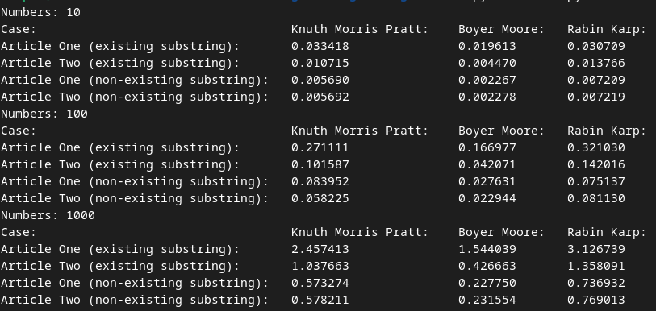

### Завдання 1 ([task1.py](task1.py))
Додати метод delete для видалення пар ключ-значення таблиці HashTable , яка реалізована в конспекті.

### Завдання 2 ([task2.py](task2.py))
Реалізувати двійковий пошук для відсортованого масиву з дробовими числами. Написана функція для двійкового пошуку повинна повертати кортеж, де першим елементом є кількість ітерацій, потрібних для знаходження елемента. Другим елементом має бути "верхня межа" — це найменший елемент, який є більшим або рівним заданому значенню.

### Завдання 3 ([task3.py](task3.py))
Порівняти ефективність алгоритмів пошуку підрядка: Боєра-Мура, Кнута-Морріса-Пратта та Рабіна-Карпа на основі двох текстових файлів (стаття 1, стаття 2). Використовуючи timeit, треба виміряти час виконання кожного алгоритму для двох видів підрядків: одного, що дійсно існує в тексті, та іншого — вигаданого (вибір підрядків за вашим бажанням). На основі отриманих даних визначити найшвидший алгоритм для кожного тексту окремо та в цілому.

**Case** - Завдання яке виконується в тесті

**Merge Sort** - час виконання алгоритму злиття

**Insertion Sort** - час виконання алгоритму вставкою

**Timesort** - час комбінованого алгоритму

Отже

**Merge Sort** - дає стабільні результати з точки зору часової складності, але використовує більше пам'яті через необхідність зберігання проміжних масивів.

**Insertion Sort** - ефективне на малих масивах і майже відсортованих даних, але його часові затрати зростають з ростом розміру даних.

**Timsort** - (вбудоване сортування в Python) поєднує переваги обох алгоритмів. Він використовує сортування вставками для малих масивів та сортування злиттям для великих масивів, що робить його надзвичайно ефективним на практиці. Це підтверджується тим, що Timsort значно швидший за будь-який з інших двох алгоритмів для великих масивів.

тому, згідно результатів, використання **Timsort** є найкращим вибором. База!
